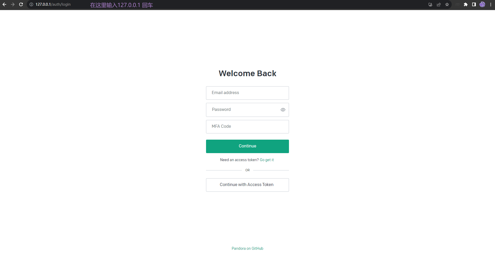

# 部署本地可以访问的ChatGPT

## 1. 安装 Docker [下载地址](https://docs.docker.com/desktop/install/windows-install)


## 2. 通过 Docker 一键部署 pandora
+ 通过 `win + R` 输入 `cmd` 打开命令命令行。 <br>

+ 然后再命令行输入下面的命令，只允许本机访问。 <br>
    ```
    docker run -itd --name chatGPT --restart unless-stopped -e PANDORA_CLOUD=cloud -e PANDORA_SERVER=0.0.0.0:80 -p 127.0.0.1:80:80 pengzhile/pandora
    ```
    

## 3. 通过浏览器访问 [http://127.0.0.1](http:127.0.0.1)


## 4. 注意事项
+ 需要拥有chatGPT 账户
+ Win10 安装 docker 需要安装或升级 WSL 才可以运行成功，以管理员的身份运行 Powershell, 然后执行下面的命令
    ```
    wsl --install
    ```
    ```
    wsl --update
    ```

## 5. 项目引用
+ [pengzhile/pandora](https://github.com/pengzhile/pandora)