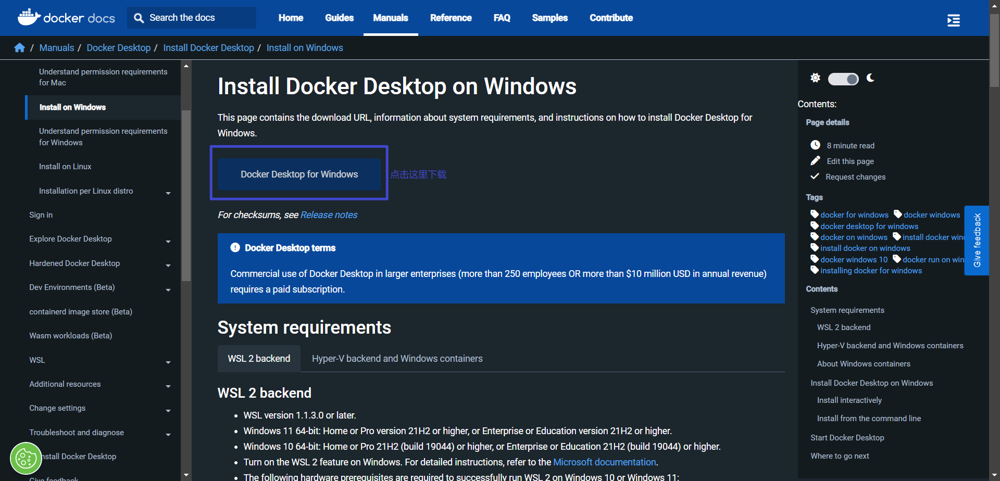
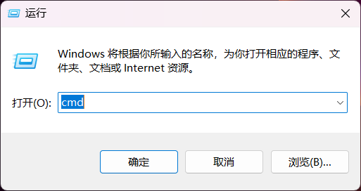
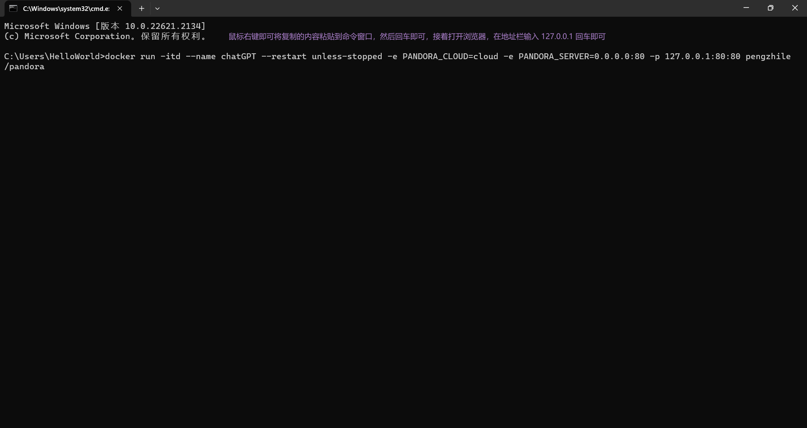

# 部署本地可以访问的ChatGPT
## 1. 安装 Docker [下载地址](https://docs.docker.com/desktop/install/windows-install/)

## 2. 通过 Docker 一键部署 pandora
+ 通过 `win + R` 输入 `cmd` 打开命令命令行。 <br>

+ 然后再命令行输入下面的命令，只允许本机访问。 <br>
    ```
    docker run -itd --name chatGPT --restart unless-stopped -e PANDORA_CLOUD=cloud -e PANDORA_SERVER=0.0.0.0:80 -p 127.0.0.1:80:80 pengzhile/pandora
    ```
    

## 3. 注意事项
+ 需要拥有chatGPT账户